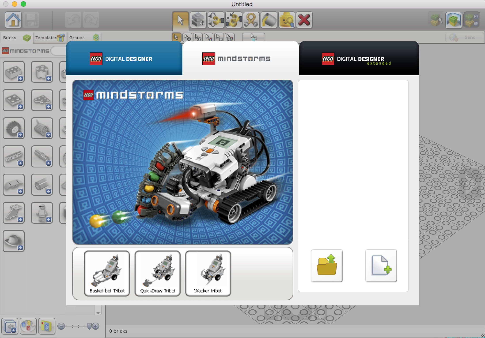

# lego digital designer

[lego digital designer](http://ldd.lego.com/en-us/) is a free [CAD](https://en.wikipedia.org/wiki/Computer-aided_design) tool built for designing LEGO structures

it works with os x and windows

