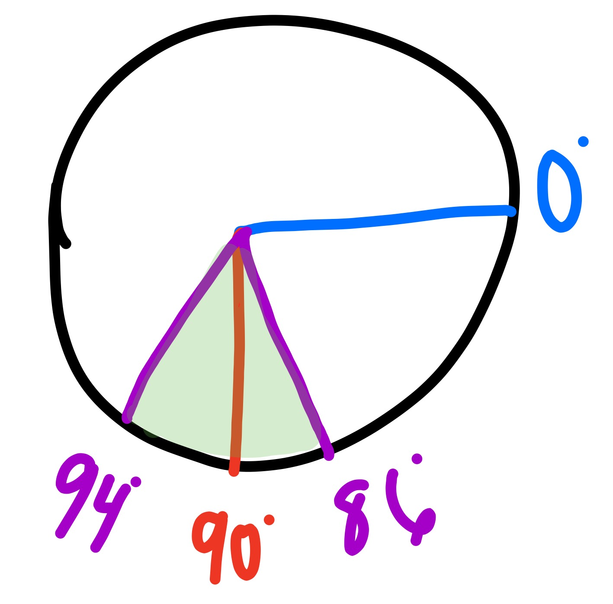
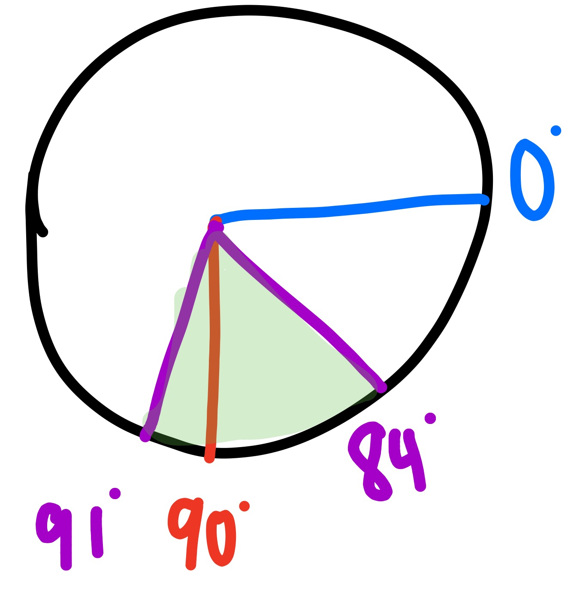

# gyro sensor

## goal

this project covers how to use a proportional controller in conjuction with a gyro sensor to do controlled rotations to arbitrary angles

## setting up the robot

a simple tank drive robot will be needed for this project. the robot will also need a gyro sensor mounted in the proper orientation

### mounting the gyro

because the gyro has only one DoF, it must be mounted in a deliberate way. the plane of the arrows on the top of the sensor should be parallel to the plane of motion we want to measure (parallel to the ground in this case)

## programming

### abstract

we will use a proportional controller for this project. this means we'll slow down as we get closer to our target angle.

the function is: `output=error*kP`

our error in this case is `starting angle` subtracted from `desired angle`

kP is the proportional constant. once we have the software working, we'll need to tune this constant

output is the commanded motor power level

#### deadband

a deadband is the allowable error for our control loop. deadband helps our robot converge more quickly on the goal. 

deadband should be balanced with speed, which in this context means how quickly our robot converges on the target angle.

if speed is favored and we don't need to be very precise, we can significantly increase the proportional constant and set a large deadband.

the picture above illustrates a `deadband of +/- 4deg` for a `goal of 90deg`

`0deg` is the starting angle

the +/- 4deg deadband means the robot will stop anywhere in between 94deg and 86deg (the area highlighted in green.

**note**: the deadband doesn't have to be symmetric. for example, you could have a deadband of +1deg and -6deg.

#### english

* read the current output angle
* calculate the error
* check if the error is within the range of the deadband
* if it is: stop. if not, output the error multiplied by the proportional constant to the motors

### dragons

winter is coming

#### tips

* ensure the gyro is in angle mode 

## notes

sometimes the gyro will drift a lot and continually increment with no motion. if this happens, unplug the sensor from the brick while the brick is on and plug it back in. 

it is best when using the gyro to leave the robot still while it starts up

the gyro block must be downloaded from the ev3 downloads page

## extra resources

https://www.youtube.com/watch?v=2vbNTyLkhHY

https://www.youtube.com/watch?v=7V16AEW3GG4

### [gyro block download](https://lc-www-live-s.legocdn.com/r/www/r/mindstorms/-/media/franchises/mindstorms%202014/downloads/firmware%20and%20software/gyro.ev3b?l.r2=-2108761645)